# IWNO4: Использование контейнеров как среды выполнения

## Цель работы:

Данная лабораторная работа призвана напомнить основные команды ОС Debian/Ubuntu. Также она позволит познакомиться с Docker и его основными командами.

## Задание:

Запустить контейнер Ubuntu, установить Web-сервер Apache и вывести в браузере страницу с текстом "Hello, World!".

## Подготовка:

Для выполнения данной работы имею установленный на компьютере Docker.

## Описание выполнения работы с ответами на вопросы:

### Создаю репозиторий `containers04`

В нём создаю файл README.md который содержит пошаговое выполнение проекта , описание проекта:

    1. Название лабораторной работы.
    2. Цель работы.
    3. Задание.
    4. Описание выполнения работы с ответами на вопросы.
    5. Выводы.

Клонирую его себе на компьютер, открываю терминал, перехожу в эту дерикторию.

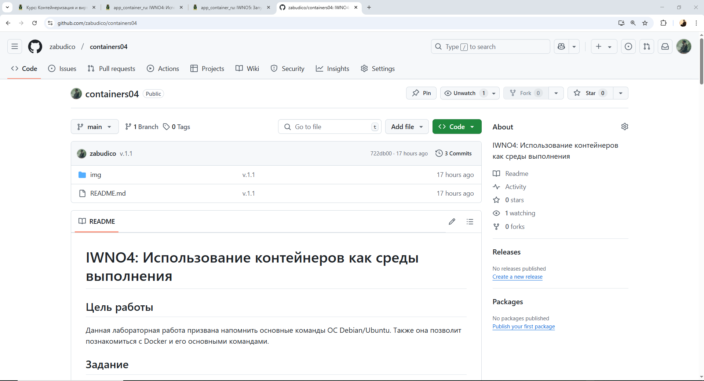

Выполняю команду:

```bash
git clone https://github.com/zabudico/containers04.git
```

#### Назначение:

Команда git clone используется для создания локальной копии удаленного репозитория Git. В данном случае она загружает содержимое репозитория, расположенного по адресу https://github.com/zabudico/containers04.git, на компьютер.

#### Результат выполнения:

В текущей рабочей директории (например, C:\Users\User\Desktop) создается новая папка с именем containers04.
Эта папка содержит все файлы, историю коммитов и ветки из удаленного репозитория.
После выполнения команды получаю полный доступ к проекту локально и могу приступить к работе с ним.

#### Вывод в консоли:

При выполнении команды git clone в терминале отображается процесс клонирования. Пример вывода может выглядеть так:

```
Cloning into 'containers04'...
remote: Enumerating objects: 10, done.
remote: Counting objects: 100% (10/10), done.
remote: Compressing objects: 100% (8/8), done.
remote: Total 10 (delta 2), reused 10 (delta 2), pack-reused 0
Unpacking objects: 100% (10/10), done.
```

```bash
PS C:\Users\User\Desktop> cd containers04
```

#### Назначение:

Команда cd (сокращение от "change directory") используется для изменения текущей рабочей директории в терминале. В данном случае она перемещает в директорию containers04, созданную после выполнения git clone.

#### Результат выполнения:

Текущая рабочая директория изменяется с `C:\Users\User\Desktop` на `C:\Users\User\Desktop\containers04`.
Теперь находимся внутри директории containers04 и могу работать с её содержимым (например, просматривать файлы или выполнять другие команды).

#### Вывод в консоли:

После выполнения команды cd containers04 в консоли отображается новая строка приглашения, показывающая, что переместился в директорию containers04.

```bash
PS C:\Users\User\Desktop\containers04>
```

### Запуск и тестирование

Запускаю DockerDesktop.
Открываю терминал в папке `containers04` и выполняю команду:

```bash
docker run -ti -p 8000:80 --name containers04 ubuntu bash
```

#### Назначение:

Эта команда запускает новый контейнер Docker на основе образа `ubuntu` и открывает интерактивную сессию Bash внутри контейнера.

- `docker run` : запускает контейнер.
- `ti` : Комбинирует флаги -t (выделяет псевдотерминал) и -i (держит STDIN открытым), что позволяет взаимодействовать с контейнером через терминал.
- `p 8000:80` : Связывает порт 80 внутри контейнера с портом 8000 на хост-машине, чтобы веб-сервер (который позже установлю) был доступен через localhost:8000.
- `--name containers04` : Присваивает контейнеру имя containers04.
- `ubuntu` : Указывает базовый образ (Ubuntu).
- `bash` : Команда, которая выполняется при запуске контейнера открывает оболочку Bash.

#### Результат выполнения:

Создаётся новый контейнер, и вы попадаете в интерактивную сессию Bash внутри него.

#### Вывод в консоли:

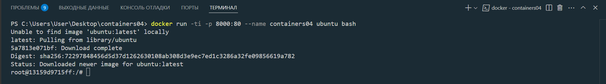

- В открывшемся окне выполняю следующие команды:

```bash
apt update
apt install apache2 -y
service apache2 start
```

#### Назначение `apt update`:

Обновляет список пакетов в репозиториях Ubuntu внутри контейнера. Это необходимо для получения актуальной информации о доступных пакетах перед установкой программ.

#### Результат выполнения:

Список пакетов обновляется, загружаются данные из репозиториев Ubuntu.

#### Вывод в консоли:

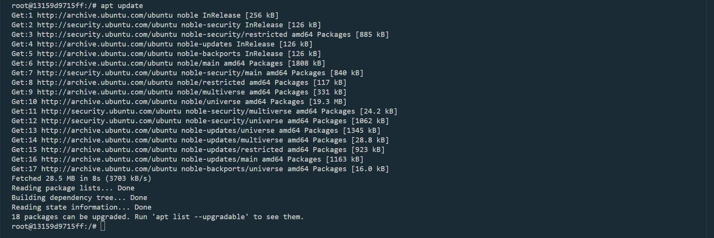

#### Назначение `apt install apache2 -y`:

Устанавливает веб-сервер Apache2 внутри контейнера. Флаг `-y` автоматически подтверждает установку, не требуя ввода от пользователя.

#### Результат выполнения:

Apache2 устанавливается вместе с необходимыми зависимостями.

#### Вывод в консоли:

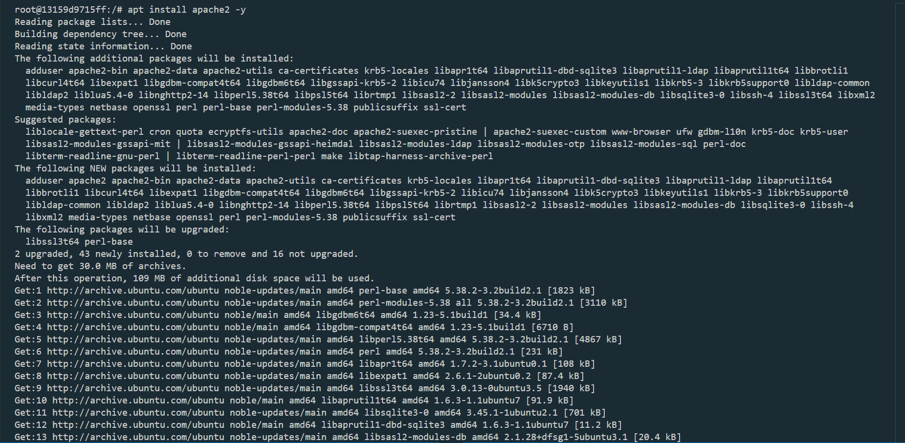

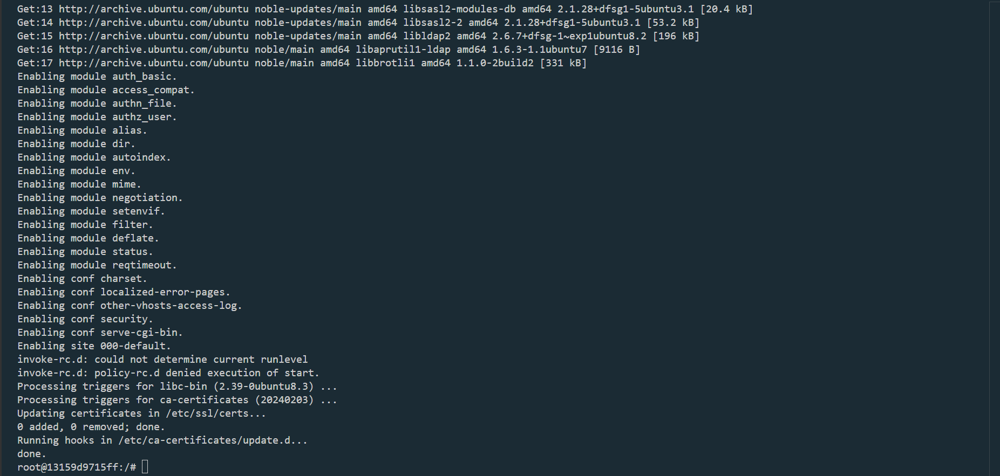

#### Назначение `service apache2 start`:

Запускает сервис Apache2 внутри контейнера. После этого веб-сервер начинает прослушивать порт 80 внутри контейнера, который связан с портом 8000 хоста.

#### Результат выполнения:

Apache2 запускается и становится активным.

#### Вывод в консоли:

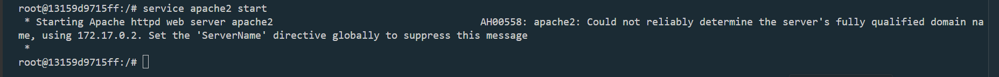

Открываю браузер и ввожу в адресной строке http://localhost:8000.

#### Назначение:

Проверка работы веб-сервера Apache2 через браузер. Поскольку порт 80 контейнера привязан к порту 8000 хоста, запрос к localhost:8000 направляется к Apache2.

#### Результат выполнения:

Отображается стандартная страница Apache2, которая обычно содержит приветственное сообщение и информацию о сервере.

#### Вывод в браузере:

Что я вижу:

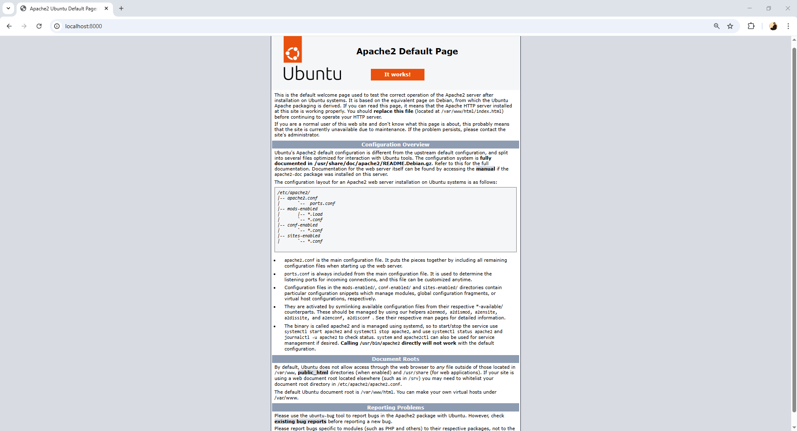

- Выполняю следующие команды:

```bash
ls -l /var/www/html/
echo '<h1>Hello, World!</h1>' > /var/www/html/index.html
```

#### Назначение `ls -l /var/www/html/`:

Выводит список файлов в директории `/var/www/html/`, которая является корневой директорией веб-сервера Apache2.

#### Результат выполнения:

Показывает содержимое директории. По умолчанию там находится файл index.html.

#### Вывод в консоли:

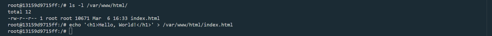

#### Назначение `echo '<h1>Hello, World!</h1>' > /var/www/html/index.html`:

Перезаписывает содержимое файла `index.html` в директории `/var/www/html/` строкой `<h1>Hello, World!</h1>`. Это изменяет главную страницу веб-сервера.

#### Результат выполнения:

Файл `index.html` обновляется с новым содержимым.

#### Вывод в консоли:

Команда не выводит ничего, так как перенаправление (>) просто записывает данные в файл.

Обновляю страницу в браузере. Что я вижу:

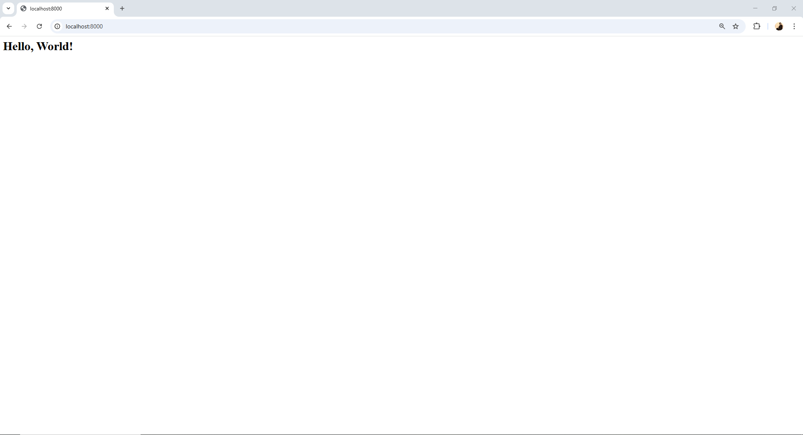

#### Назначение:

Проверка обновлённой страницы после изменения index.html.

#### Результат выполнения:

Браузер отображает новую страницу с текстом "Hello, World!" вместо стандартной страницы Apache2.

- Выполняю следующие команды:

```bash
cd /etc/apache2/sites-enabled/
cat 000-default.conf
```

#### Назначение `cd /etc/apache2/sites-enabled/`:

Меняет текущую директорию на /etc/apache2/sites-enabled/, где хранятся конфигурационные файлы для активных сайтов Apache2.

#### Результат выполнения:

Переход в указанную директорию.

#### Вывод в консоли:

Строка приглашения изменяется.

#### Назначение `cat 000-default.conf`:

Выводит содержимое файла `000-default.conf` — конфигурационного файла по умолчанию для виртуального хоста Apache2.

#### Результат выполнения:

Отображается конфигурация, включая путь к корневой директории (/var/www/html) и настройки логов.

#### Вывод в консоли:

Что я вижу на экране:

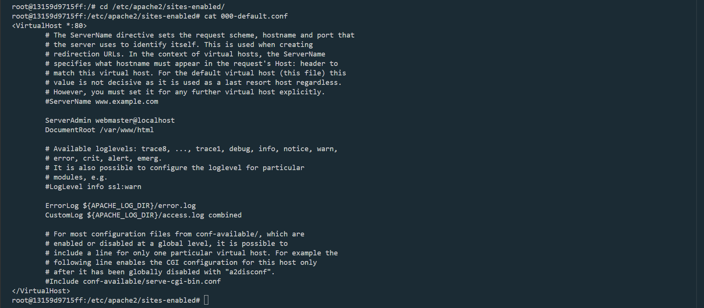

Закрываю окно терминала командой `exit`.

#### Назначение `exit`:

Закрывает интерактивную сессию Bash внутри контейнера и возвращает управление в терминал хост-машины.

#### Результат выполнения:

Контейнер останавливается, и вы возвращаетесь в терминал хоста.


Просматриваю список контейнеров:

```bash
docker ps -a
```

#### Назначение `docker ps -a`:

Выводит список всех контейнеров Docker на хосте, включая остановленные.

#### Результат выполнения:

Показывает контейнер containers04 с его статусом (остановлен).

#### Вывод в консоли:

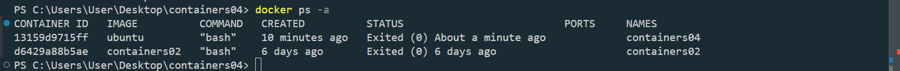

Удаляю контейнер:

```bash
docker rm containers04
```

#### Назначение `docker rm containers04`:

Удаляет контейнер с именем containers04.

#### Результат выполнения:

Контейнер удаляется из системы.

#### Вывод в консоли:

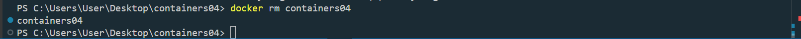

## Выводы

В ходе выполнения лабораторной работы были успешно реализованы все поставленные задачи:

- Создан и настроен репозиторий containers04 на GitHub.
- Запущен контейнер Ubuntu с использованием Docker.
- Установлен и запущен веб-сервер Apache2 внутри контейнера.
- Настроена веб-страница с текстом "Hello, World!", доступная через браузер по адресу http://localhost:8000.
- Просмотрена конфигурация Apache2 для понимания структуры виртуального хоста.
- Завершена работа с контейнером: он остановлен и удален.

#### Работа позволила:

- Освежить знания команд ОС Debian/Ubuntu, таких как apt update, apt install, service.
- Познакомиться с основными командами Docker: docker run, docker ps, docker rm.
- На практике освоить использование контейнеров как среды выполнения для развертывания веб-сервера.
