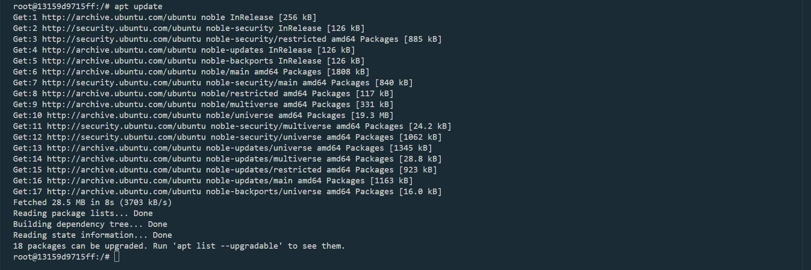
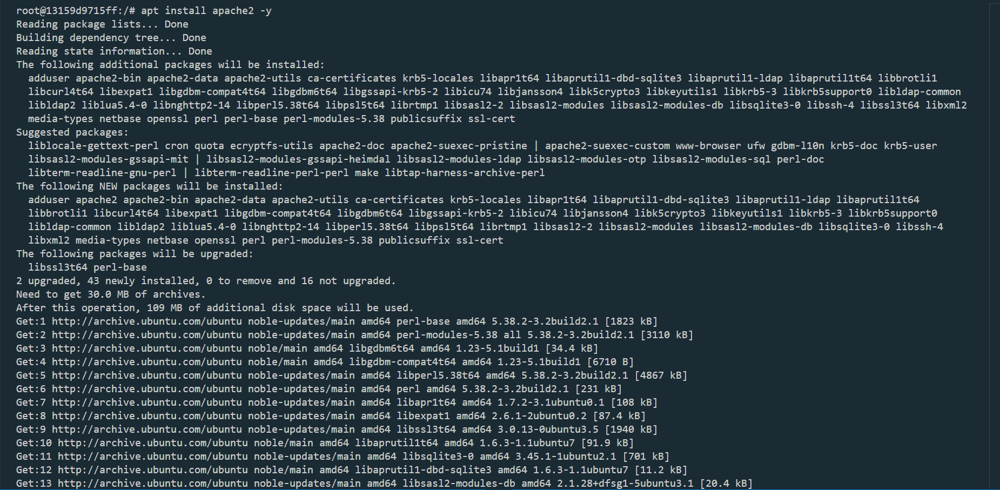
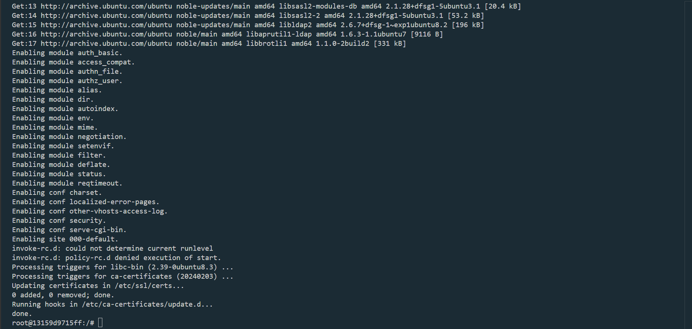
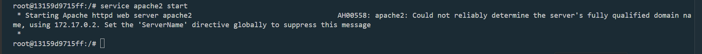
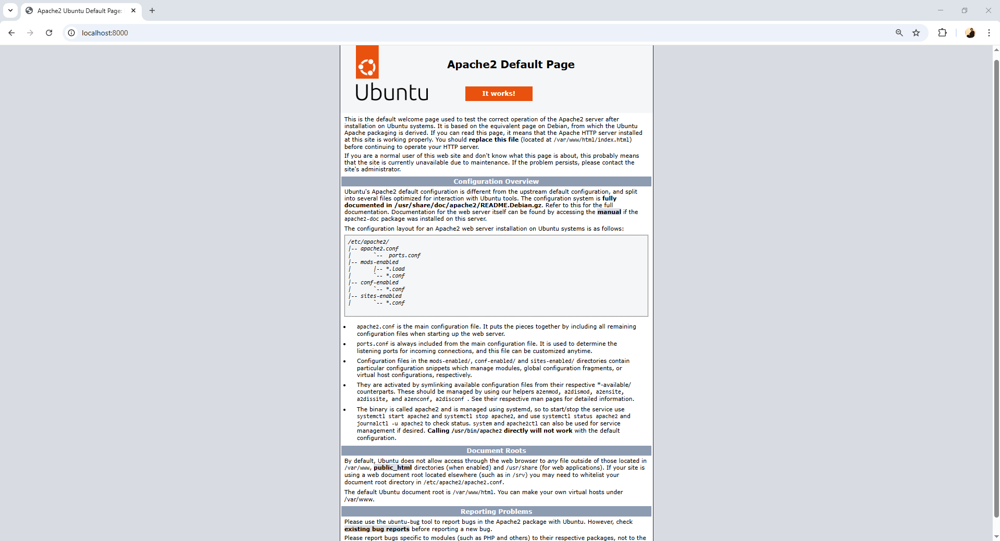
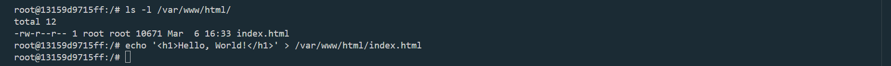
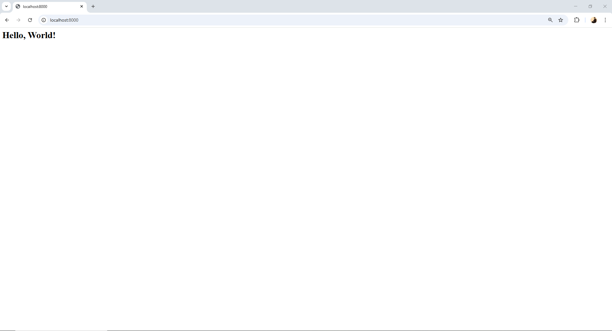
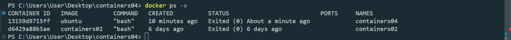
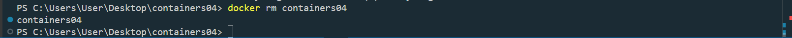

# IWNO4: Использование контейнеров как среды выполнения

## Цель работы

Данная лабораторная работа призвана напомнить основные команды ОС Debian/Ubuntu. Также она позволит познакомиться с Docker и его основными командами.

## Задание

Запустить контейнер Ubuntu, установить Web-сервер Apache и вывести в браузере страницу с текстом "Hello, World!".

## Выполнение

Создаю репозиторий `containers04`,в нём создаю файл README.md который содержит пошаговое выполнение проекта и клонирую его себе на компьютер, открываю терминал, перехожу в эту дерикторию.

```bash
PS C:\Users\User\Desktop> cd containers04
```

```bash
PS C:\Users\User\Desktop\containers04>
```

Запускаю DockerDesktop (это нужно для дальнейшей работы)

Выполняю команду:
`docker run -ti -p 8000:80 --name containers04 ubuntu bash`

    docker run - запускает контейнер

    -ti - комбинация двух флагов (-t и -i), которая запускает псевдотерминал для взаимодействия с контейнером

    -p - флаг для маппинга порта 8000:80 (Мы мыпим внутренний порт контейнера 80 на внешний порт 8000) (В дальнейшем мне придётся перемапить порт на 8080 т.к 8000 занят на моём компьютере)

    --name containers04 - задаёт имя контейнера

    ubuntu bash - указывает что в качестве образа мы используем образ ubuntu и запускаем bash, с которой будем взаимодействовать через терминал, заданный флагом -ti


В открывшемся окне выполняю следующие команды:

```bash
apt update
apt install apache2 -y
service apache2 start
```









Открываю браузер и ввожу в адресной строке http://localhost:8000. Вот что я вижу:



Выполняю следующие команды:

```bash
ls -l /var/www/html/
echo '<h1>Hello, World!</h1>' > /var/www/html/index.html
```



Обновляю страницу в браузере. Вот что я вижу:



Выполняю следующие команды:

```bash
cd /etc/apache2/sites-enabled/
cat 000-default.conf
```


Что я вижу на экране:

&&&&&&&&&&&&&&&&&&&&&&&&&&&&&&&&&&&&&
&&&&&&&&&&&&&&&&&&&&&&&&&&&&&&&&&&&&&
&&&&&&&&&&&&&&&&&&&&&&&&&&&&&&&&&&&&&
&&&&&&&&&&&&&&&&&&&&&&&&&&&&&&&&&&&&&

Закрываю окно терминала командой `exit`.


Просматриваю список контейнеров:

```bash
docker ps -a
```



Удаляю контейнер:

```bash
docker rm containers04
```


